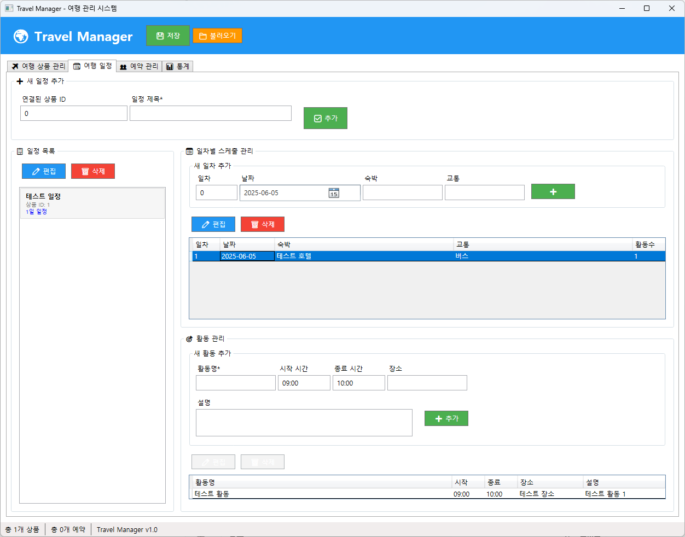
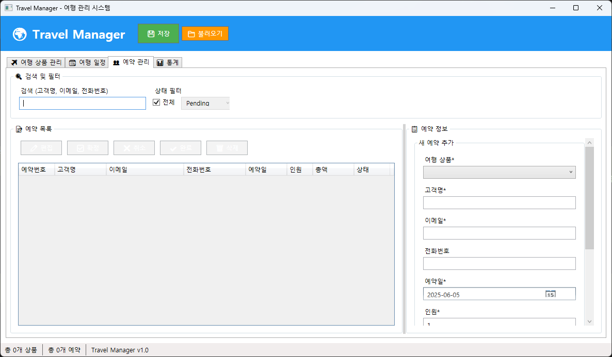

# Travel Manager - 여행 관리 프로그램

> **개발 기간**: 2025년 5월 ~ 현재 진행중  
> **개발 목적**: WPF 기술 스택 확장 및 엔터프라이즈 애플리케이션 개발 경험  
> **개발자**: 유니티 게임 개발 4년 경력 → WPF 엔터프라이즈 애플리케이션 도메인 확장

## 프로젝트 소개

이 프로젝트는 **게임 개발에서 엔터프라이즈 애플리케이션 개발로 도메인을 확장**하며 제작한 여행 관리 시스템입니다.

4년간 유니티 게임 개발 경험을 바탕으로, 비즈니스 애플리케이션 개발 역량을 확장하고자 WPF 기술 스택을 도입했습니다.

**프로젝트 목표:**

-   게임 로직 중심에서 비즈니스 로직 중심 개발로의 전환 경험
-   MVVM 패턴과 데이터 바인딩을 활용한 엔터프라이즈급 애플리케이션 구축
-   완성도 높은 포트폴리오를 통한 개발 역량 입증

## 구현한 주요 기능들

### 1. 여행 상품 관리

-   **여행 상품 CRUD**: 각 기능을 별도 모듈로 분리하여 확장성과 유지보수성 확보
-   **실시간 검색**: TextChanged 이벤트 최적화를 통한 성능 개선 적용
-   **목적지별 필터링**: ComboBox와 데이터 바인딩을 활용한 직관적인 UI 구현
-   **데이터 저장**: Newtonsoft.Json을 활용한 효율적인 데이터 관리


_여행 상품 CRUD 및 실시간 검색 기능_

**기술적 고려사항:**

-   DataGrid 바인딩 최적화 및 성능 튜닝
-   비즈니스 로직과 UI 로직의 명확한 분리

### 2. 여행 일정 관리

**복잡한 계층적 데이터 구조**를 효과적으로 관리하는 핵심 모듈입니다.

-   **3단계 계층 구조**: 일정 → 일차 → 활동의 중첩된 ObservableCollection 구조 설계
-   **직관적인 UI 설계**: TreeView 대신 3개의 연동된 ListBox로 사용성 개선
-   **데이터 무결성**: 삭제 작업 시 사용자 확인을 통한 데이터 보호


_3단계 계층 구조의 일정 관리 인터페이스_

**설계 철학:**

-   복잡한 데이터 구조를 사용자 친화적인 인터페이스로 추상화
-   실수 방지를 위한 적절한 가드 레일 구현

### 3. 예약 관리

-   **모듈화된 설계**: 고객 정보와 예약 정보를 별도 클래스로 분리하여 책임 분담
-   **상태 관리**: Enum을 활용한 명확하고 확장 가능한 예약 상태 관리
-   **반응형 계산**: PropertyChanged 이벤트를 통한 실시간 가격 계산 자동화


_고객 정보 및 예약 상태 관리_

**비즈니스 로직 고려사항:**

-   예약 취소 시 데이터 보존을 통한 이력 관리 및 분석 데이터 확보

### 4. 통계 기능

-   **LiveCharts 연동**: 외부 라이브러리를 효과적으로 통합한 데이터 시각화
-   **실시간 업데이트**: 이벤트 기반 차트 동기화를 통한 반응형 UI 구현
-   **월별 매출 분석**: DateTime 연산을 활용한 비즈니스 인사이트 제공


_LiveCharts를 활용한 실시간 데이터 시각화_

## 사용한 기술 스택

**핵심 기술:**

-   **.NET 8.0**: 최신 기술 스택을 활용한 현대적 애플리케이션 개발
-   **WPF**: 풍부한 사용자 경험을 위한 데스크톱 애플리케이션 프레임워크
-   **MVVM 패턴**: 관심사 분리와 테스트 가능한 구조 설계

**외부 라이브러리:**

-   **Newtonsoft.Json**: 안정적이고 널리 검증된 JSON 직렬화 라이브러리
-   **LiveCharts**: 인터랙티브한 데이터 시각화를 위한 차트 라이브러리

## 프로젝트 아키텍처

```
TravelManager/
├── Models/          # 도메인 모델 및 데이터 구조
├── ViewModels/      # MVVM 패턴의 비즈니스 로직 계층
├── Services/        # 데이터 접근 및 외부 서비스 연동
├── Helpers/         # 공통 유틸리티 및 확장 메서드
└── Views/           # 사용자 인터페이스 레이어
```

## 실행 방법

**개발 환경:**

-   Visual Studio 2022 (Community 이상)
-   .NET 8.0 SDK

## 핵심 개발 경험

### 게임 개발에서 비즈니스 애플리케이션으로의 전환:

1. **아키텍처 설계**: 게임의 컴포넌트 기반 구조에서 MVVM 패턴으로의 사고 전환
2. **데이터 관리**: 게임 상태 관리 경험을 비즈니스 데이터 관리로 확장 적용
3. **사용자 경험**: 게임 플레이어에서 비즈니스 사용자로의 UX 패러다임 변화 적응
4. **성능 최적화**: 게임 성능 튜닝 경험을 데이터 바인딩 최적화에 응용

### 기술적 도전과 해결:

-   **복잡한 데이터 바인딩**: ObservableCollection과 PropertyChanged 이벤트를 활용한 반응형 UI 구현
-   **계층적 데이터 구조**: 중첩된 컬렉션 관리 및 UI 동기화 문제 해결
-   **비즈니스 로직 분리**: MVVM 패턴을 통한 테스트 가능하고 유지보수 가능한 코드 구조 달성

## 기술적 성과와 학습

**핵심 역량 확장:**

1. **WPF & XAML**: 선언적 UI 개발 및 고급 데이터 바인딩 기법 습득
2. **MVVM 패턴**: 엔터프라이즈급 애플리케이션 아키텍처 설계 경험
3. **비즈니스 로직 설계**: 게임 로직과 차별화된 비즈니스 도메인 모델링
4. **데이터 관리**: JSON 직렬화부터 복잡한 객체 그래프 관리까지의 포괄적 경험

**개발 프로세스 개선:**

-   게임 개발의 반복적 프로토타이핑 경험을 비즈니스 애플리케이션의 점진적 개선에 적용
-   사용자 피드백 기반 개발 프로세스 확립

## 프로젝트 의의

4년간의 게임 개발 경험을 바탕으로 새로운 도메인에서도 빠르게 적응하고 완성도 높은 애플리케이션을 개발할 수 있음을 입증하는 프로젝트입니다.

기존 개발 경험의 깊이를 유지하면서도 새로운 기술 스택과 비즈니스 도메인에 대한 학습 능력과 적응력을 보여주는 포트폴리오로 완성했습니다.

**개발 철학:**
탄탄한 기술적 기반 위에서 지속적인 학습을 통해 새로운 도메인으로 역량을 확장해나가는 것이 진정한 개발자의 성장이라고 생각합니다.

---

> **개발 노트**: 체계적인 학습과 지속적인 코드 리팩토링을 통해 유지보수 가능하고 확장 가능한 애플리케이션 구조를 완성했습니다.
